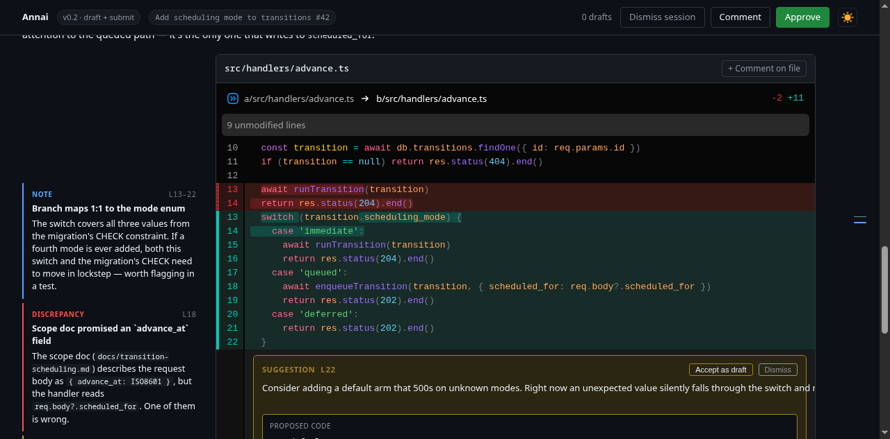

# Annai (案内) — Claude Code Code Review Surface

Turn a code review into a guided browser surface. Two agent skills —
`review-pr` (review a GitHub pull request) and `review-local` (review code
an LLM agent just produced locally) — generate a structured, ordered view
of the change: base context first, then entry points, then supporting
code, with typed side notes, inline suggestions, and mermaid diagrams. A
local server renders it. In PR mode the reviewer's decision pushes to
GitHub via GraphQL; in local-agent mode it lands as `result.json` for the
agent to read back.



## Why

Reviewing a PR you don't already have the context for is mostly assembly
work: jumping between Notion, Slack threads, design docs, and the diff
just to build a mental model before you can judge anything. Annai moves
that assembly into an agent step and hands the reviewer a surface that
explains the *why* alongside the *what* — in the order that makes sense.

Read the long form in [`docs/code-review-surface.md`](./docs/code-review-surface.md);
the runtime design lives in [`docs/annai-architecture.md`](./docs/annai-architecture.md).

## Features

- **Ordered surface.** Base context → entry points → supporting code,
  not alphabetical file list. Group-level intros explain *why* a set
  of diffs belongs together.
- **Typed side notes** on individual diffs — `note`, `question`,
  `pattern`, `surface-check`, `discrepancy` — rendered in a column
  alongside the code so the reviewer reads the *why* next to the
  *what*.
- **Agent suggestions inline.** The agent can attach `suggestion`
  blocks with an alternative snippet; the reviewer accepts as a
  draft comment or dismisses with one click.
- **Mermaid diagrams** at the PR level or per-group, with light- and
  dark-theme palettes that follow the page toggle.
- **Markdown everywhere.** Tldr, group intros, annotations,
  suggestions, drafts, and review prompts all render markdown
  (code, lists, links, bold).
- **Drafting**: line, multi-line range, whole-file (composer is
  attached to the file header so it expands inline under the diff
  bar), and the overall PR body. Every composer accepts
  `Ctrl/Cmd+Enter` to save.
- **Decision picker**: in PR mode, *Approve*, *Comment*, or *Dismiss
  session*. In local-agent mode, *Finish review* (no Approve — there's
  nothing to approve against) or *Dismiss session*. Submitting opens a
  confirmation modal that previews the queued comments grouped by file
  and lets you author the overall body right there.
- **Single-shot GitHub submission** (PR mode) via `gh api graphql`: one
  `addPullRequestReview` (with line/range threads), one
  `addPullRequestReviewThread` per file-level draft
  (`subjectType: FILE`), one `submitPullRequestReview` to finalise. All
  comments land in one review event — the reviewer never sees them
  arrive one at a time.
- **Local-agent terminus.** In local-agent mode there's no GitHub call;
  the daemon writes `result.json` and `annai.sh result --session <id>`
  dumps it for the agent to read back as feedback.
- **Light / dark theme** with a one-click toggle in the top nav.
  Mermaid, the diff viewer, and every annotation respect it.
- **Surface authoring CLI** the agent drives instead of plain-editing
  `surface.json`: `scaffold` parses a GitHub PR diff into a typed
  skeleton, `scaffold-local` does the same from a local `git diff` the
  agent ran itself, and `*-add` / `*-update` / `*-drop` / `set-*`
  mutate the surface atomically with zod validation on every write.
- **Client-side error capture.** `window.onerror`, unhandled
  rejections, and React error boundaries all POST to the daemon and
  surface in `annai.sh status` and on the watch stream.

## Install

From the `asermax-plugins` marketplace:

```
/plugin marketplace add asermax/claude-plugins
/plugin install annai@asermax-plugins
```

Or point Claude Code directly at this repo.

## Usage

From any Claude Code session in the repo you want to review:

```
/annai:review-pr <PR url or number>      # review a GitHub PR
/annai:review-local                      # review the current local change
```

Either skill will:

1. Resolve the subject. `review-pr` reads the PR via `gh pr view` / `gh
   pr diff`. `review-local` picks the diff source by precedence —
   explicit user request → uncommitted changes (`git diff HEAD`) →
   branch vs default base (`git diff <base>...HEAD`) → if ambiguous, it
   asks you which.
2. Ask once for context (Notion pages, design docs, transcripts,
   anything — or `'none'` to proceed with just the diff).
3. Scaffold `surface.json` (`annai.sh surface scaffold --pr ...` for
   PRs, `annai.sh surface scaffold-local --diff ...` for local
   changes — both parse every hunk for you), then regroup files and
   attach annotations / suggestions / diagrams via the `surface`
   subcommand family — grounded in the diff and the supplied context.
4. Start the local server, open your browser, and tell you the URL.
5. Watch for the events the reviewer triggers in the browser: drafting
   line / range / file / top-level comments, accepting or dismissing
   suggestions, picking Approve / Comment / Finish review and
   confirming.
6. On submit:
   - **PR mode** — run `annai.sh submit`, a single GraphQL submission
     to GitHub that lands the whole review with one notification, and
     report the resulting review URL.
   - **Local-agent mode** — read `result.json` via `annai.sh result`
     and translate the drafts into agent-actionable notes. No GitHub
     call.
7. On Dismiss session, close cleanly with no remote call in either
   mode.

## How it works

```
agent → annai.sh start ──► detached daemon ──► browser at 127.0.0.1:<port>
                                │
                                ├── http: GET /api/surface, /api/state
                                │         POST/PATCH/DELETE /api/drafts
                                │         PUT /api/pr-body
                                │         POST /api/submit, /api/dismiss
                                ├── unix socket: command frames (status, stop, result)
                                │                + watch stream (line-delim events)
                                └── state: surface.json, state.json, events.log, result.json

agent → annai.sh watch    ──► subscribes to filtered events (review-submitted, …)
agent → annai.sh result   ──► fetches result.json after review-submitted (local-agent terminus)
agent → annai.sh submit   ──► single gh api graphql submission to GitHub (PR terminus; refuses if subject.kind ≠ 'pr')
agent → annai.sh stop     ──► graceful shutdown
```

- The agent never speaks HTTP — only `annai.sh` subcommands over a unix
  socket. The browser is the only HTTP client.
- The daemon binds 127.0.0.1 with an auto-picked port and writes its
  state to `$XDG_RUNTIME_DIR/annai/sessions/<id>/` (falling back to
  `${TMPDIR:-/tmp}/annai-$UID/...`).
- Diffs in `surface.json` reproduce the actual change verbatim — for
  both PR and local subjects. Annotations must be grounded in the diff
  or supplied context.
- `surface.subject` is a discriminated union (`kind: 'pr' | 'local'`);
  the frontend, CLI submitters, and rendered header all branch on it.
- GitHub submission goes through GraphQL (not REST), because file-level
  comments require GraphQL's `subjectType: FILE`. All comments land in
  one review event regardless.

## Development

```sh
cd skills/review/scripts/app
npm install
npm run build           # tsc + vite
npm test                # vitest
npm run gen:schema      # regenerate references/surface.schema.json from zod
```

Manual smoke against the bundled example surface:

```sh
./skills/review/scripts/annai.sh start \
  --surface ./skills/review/references/surface-example.json \
  --session smoke1
# → opens the browser at http://127.0.0.1:<port>/
./skills/review/scripts/annai.sh stop --session smoke1
```

Smoke the surface-authoring CLI against a real PR. `--repo` takes
either an `OWNER/REPO` slug or a local clone path:

```sh
./skills/review/scripts/annai.sh surface scaffold \
  --pr <n> --repo . --out /tmp/surface.json

# Or for a local change (no GitHub, no gh shell-out):
git diff HEAD > /tmp/local.diff
./skills/review/scripts/annai.sh surface scaffold-local \
  --repo . --diff /tmp/local.diff --title "Agent draft" \
  --base-ref HEAD --out /tmp/local-surface.json

# Pre- and post-editing checks.
./skills/review/scripts/annai.sh surface validate --surface /tmp/surface.json
./skills/review/scripts/annai.sh surface show     --surface /tmp/surface.json --text
./skills/review/scripts/annai.sh surface show     --surface /tmp/surface.json --diff <id> --text

# Edits (every op also accepts --json / --quiet / --help).
./skills/review/scripts/annai.sh surface group-add        ...
./skills/review/scripts/annai.sh surface group-update     --id entry --title "Entry point"
./skills/review/scripts/annai.sh surface annotation-update --diff <id> --id <ann> --body-file new.md
./skills/review/scripts/annai.sh surface set-tldr         --body-file tldr.md
./skills/review/scripts/annai.sh surface set-review-prompts --file prompts.txt

./skills/review/scripts/annai.sh surface          # full sub-op list with global flags
```

More dev notes — layout, key invariants, dogfood targets — live in
[`CLAUDE.md`](./CLAUDE.md).

## Name

案内 (*annai*) — "guidance, showing the way". The core action is guiding
the reviewer through the code in the right order to comprehend it.

## License

MIT.
