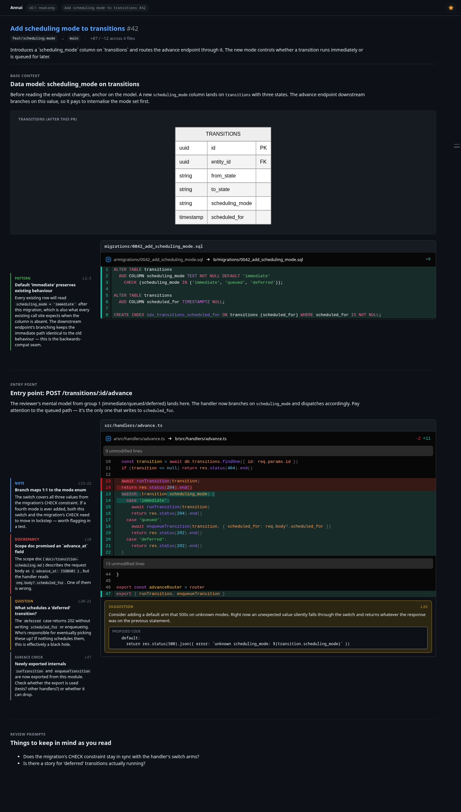

# Annai (案内) — Claude Code Code Review Surface

Turn a code review into a guided browser surface. An agent skill generates
a structured, ordered view of a pull request — base context first, then
entry points, then supporting code — with typed side notes, inline
suggestions, and mermaid diagrams. A local server renders it.



## Why

Reviewing a PR you don't already have the context for is mostly assembly
work: jumping between Notion, Slack threads, design docs, and the diff
just to build a mental model before you can judge anything. Annai moves
that assembly into an agent step and hands the reviewer a surface that
explains the *why* alongside the *what* — in the order that makes sense.

Read the long form in [`docs/code-review-surface.md`](./docs/code-review-surface.md);
the runtime design lives in [`docs/annai-architecture.md`](./docs/annai-architecture.md).

## Status — v0.2 (drafts → submit)

What works:

- The `review` skill drives `annai.sh surface ...` to author the
  review: `surface scaffold` parses the PR diff into a typed,
  schema-valid skeleton; `group-add` / `diff-move` / `annotation-add`
  / `suggestion-add` / `diagram-add` (and their `-drop` pairs)
  mutate it atomically with zod validation on every write. The
  agent never composes hunks or edits the JSON structure by hand.
- A local daemon serves a React frontend (diff rendering via
  `@pierre/diffs`, diagrams via `mermaid`).
- **Drafting comments** inline on a line, on a multi-line range, on a
  whole file, or as a top-level PR body. Agent suggestions can be
  accepted as drafts or dismissed.
- **Decision picker** — Approve or Comment — with a third action,
  Dismiss session, that closes without sending. Every action opens a
  confirmation modal that previews the comments grouped by file.
- **Single-shot GitHub submission** via `gh api graphql`: one
  `addPullRequestReview` (with line/range threads), one
  `addPullRequestReviewThread` per file-level draft (`subjectType: FILE`),
  one `submitPullRequestReview` to finalise. The reviewer never sees
  comments arrive on the PR one at a time.

Not yet (v0.3):

- **Ask-agent threads** — inline "ask the agent" interaction from the
  browser, with the agent replying via `annai.sh reply`. The `reply` CLI
  subcommand is still a stub.

## Install

From the `asermax-plugins` marketplace:

```
/plugin marketplace add asermax/claude-plugins
/plugin install annai@asermax-plugins
```

Or point Claude Code directly at this repo.

## Usage

From any Claude Code session in the repo you want to review:

```
/annai:review <PR url or number>
```

The skill will:

1. Resolve the PR + repo path, asking for a local clone if it's
   ambiguous.
2. Ask once for context (Notion pages, design docs, transcripts,
   anything — or `'none'` to proceed with just the diff).
3. Scaffold `surface.json` from the PR (`annai.sh surface scaffold`
   parses every hunk for you), then regroup files and attach
   annotations / suggestions / diagrams via the `surface` subcommand
   family — grounded in the diff and the supplied context.
4. Start the local server, open your browser, and tell you the URL.
5. Watch for the events the reviewer triggers in the browser: drafting
   line / range / file / PR comments, accepting or dismissing
   suggestions, picking Approve or Comment and confirming.
6. On submit, run `annai.sh submit` — a single GraphQL submission to
   GitHub that lands the whole review with one notification — and
   report the resulting review URL.
7. On Dismiss session, close cleanly with no GitHub call.

## How it works

```
agent → annai.sh start ──► detached daemon ──► browser at 127.0.0.1:<port>
                                │
                                ├── http: GET /api/surface, /api/state
                                │         POST/PATCH/DELETE /api/drafts
                                │         PUT /api/pr-body
                                │         POST /api/submit, /api/dismiss
                                ├── unix socket: command frames (status, stop, result)
                                │                + watch stream (line-delim events)
                                └── state: surface.json, state.json, events.log, result.json

agent → annai.sh watch    ──► subscribes to filtered events (review-submitted, …)
agent → annai.sh result   ──► fetches result.json after review-submitted
agent → annai.sh submit   ──► single gh api graphql submission to GitHub
agent → annai.sh stop     ──► graceful shutdown
```

- The agent never speaks HTTP — only `annai.sh` subcommands over a unix
  socket. The browser is the only HTTP client.
- The daemon binds 127.0.0.1 with an auto-picked port and writes its
  state to `$XDG_RUNTIME_DIR/annai/sessions/<id>/` (falling back to
  `${TMPDIR:-/tmp}/annai-$UID/...`).
- Diffs in `surface.json` reproduce the actual PR verbatim. Annotations
  must be grounded in the diff or supplied context.
- GitHub submission goes through GraphQL (not REST), because file-level
  comments require GraphQL's `subjectType: FILE`. All comments land in
  one review event regardless.

## Development

```sh
cd skills/review/scripts/app
npm install
npm run build           # tsc + vite
npm test                # vitest
npm run gen:schema      # regenerate references/surface.schema.json from zod
```

Manual smoke against the bundled example surface:

```sh
./skills/review/scripts/annai.sh start \
  --surface ./skills/review/references/surface-example.json \
  --session smoke1
# → opens the browser at http://127.0.0.1:<port>/
./skills/review/scripts/annai.sh stop --session smoke1
```

Smoke the surface-authoring CLI against a real PR:

```sh
./skills/review/scripts/annai.sh surface scaffold \
  --pr <n> --repo . --out /tmp/surface.json
./skills/review/scripts/annai.sh surface          # full sub-op list
```

More dev notes — layout, key invariants, dogfood targets — live in
[`CLAUDE.md`](./CLAUDE.md).

## Name

案内 (*annai*) — "guidance, showing the way". The core action is guiding
the reviewer through the code in the right order to comprehend it.

## License

MIT.
