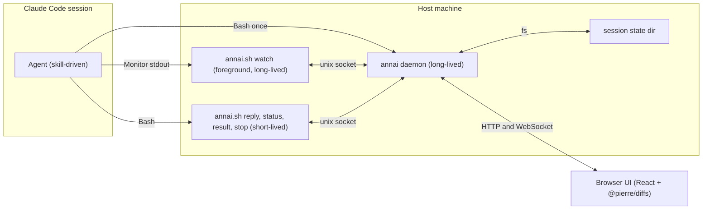
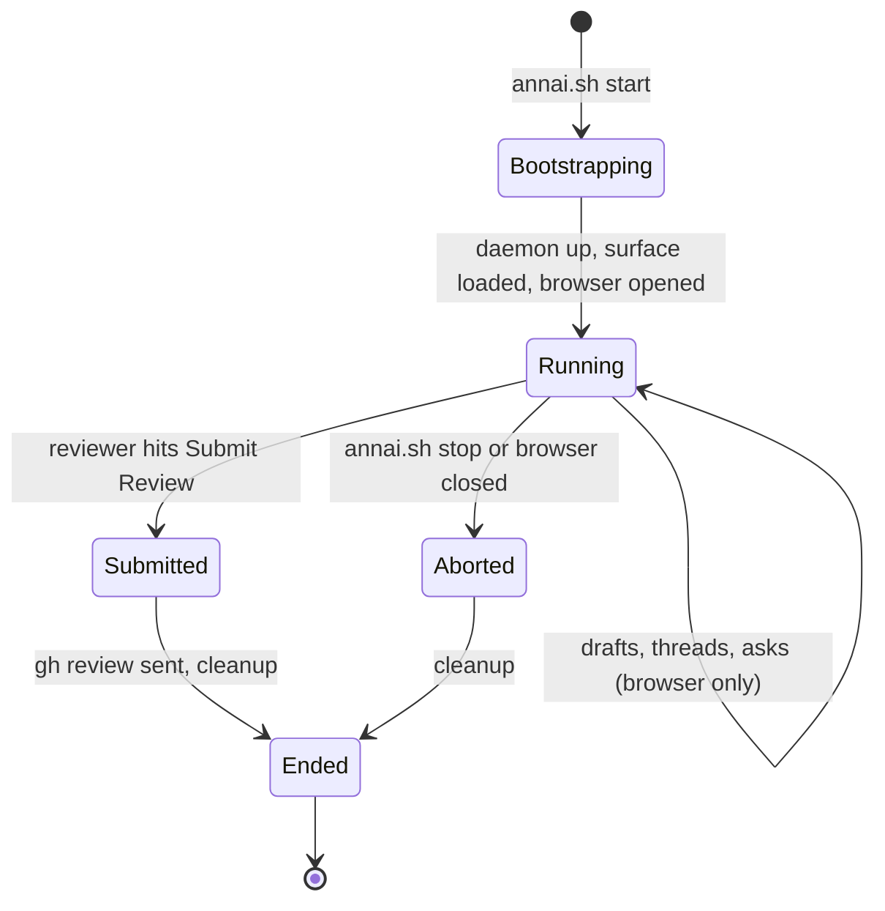
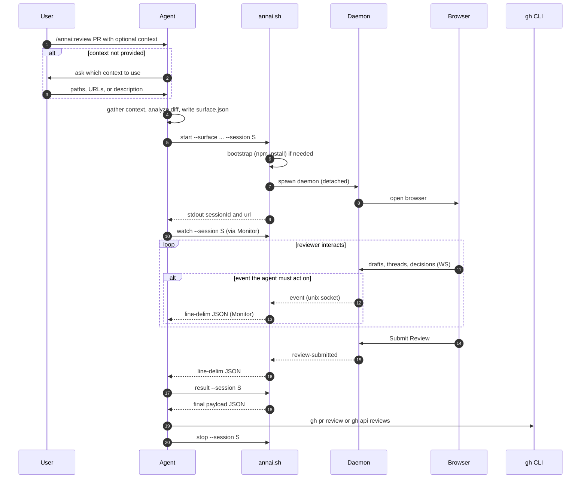
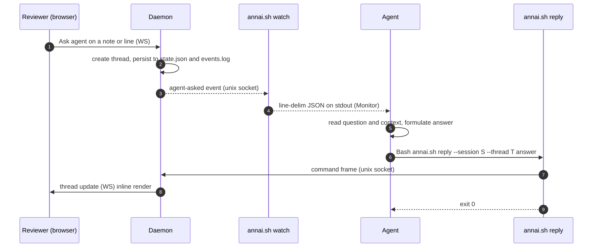
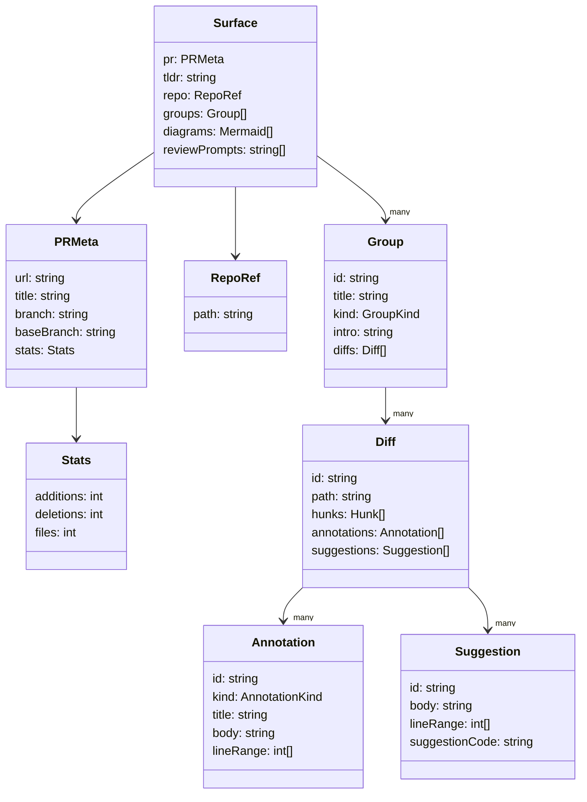

# Annai — Architecture Design

## Context

`Annai` (案内, "guidance / showing the way") is the implementation name for the
[[code-review-surface]] idea.
The prototypes have run their course as HTML mocks; the next step is to design
the runtime architecture so it can be built and dogfooded against real PRs
(Tachikoma + Filadd).

The design follows the live-server + agent-skill direction laid out in the idea
note, but diverges from plannotator's blocking-CLI model: Annai needs
*mid-session* interactivity — selected events stream back to the agent while
the reviewer reads, the agent answers "ask agent" questions inline, and the
session ends with a structured payload the agent feeds to `gh pr review`.

Goal of this plan: lock down the moving parts, file layout, event protocol,
CLI surface, and skill responsibilities so implementation can start.

---

## Decisions locked in

| # | Decision | Choice |
|---|---|---|
| 1 | Scope | Plugin contains **both** the runtime (CLI + daemon + frontend) and the agent skill. The skill *authors* the surface JSON via the `annai.sh surface ...` CLI (scaffold + scoped mutators) and the CLI/daemon *consumes* it to run the interactive session. The agent never composes hunks or edits the JSON structure by hand. |
| 2 | Slicing | The full vision splits into two slices: **v0.2** (this doc) = draft comments + decision + single-shot GitHub submission. **v0.3** = ask-agent threads (`agent-asked` event, `annai.sh reply`, inline thread UI). v0.2 ships the watch filter and event bus that v0.3 plugs into. |
| 3 | Stack | **TypeScript** end-to-end. Frontend is **React + Vite**, diff rendering via **`@pierre/diffs`** (Apache-2.0). Tests via **vitest**. |
| 4 | Event channel | `annai watch --session <id>` subcommand emitting **line-delimited JSON** on stdout. **Only events the agent must act on are emitted** — quiet by default so Monitor doesn't wake the agent on every browser keystroke. |
| 5 | Entry script | A single `annai.sh` runs the node code directly (no separate compiled binary). Does first-run bootstrap (`npm install`) internally; subsequent runs short-circuit. |
| 6 | Runtime state location | `$XDG_RUNTIME_DIR/annai/sessions/<id>/` (with `${TMPDIR:-/tmp}/annai-$UID/` fallback when `$XDG_RUNTIME_DIR` is unset). |
| 7 | No `commands/` folder | The skill itself is invoked as `/annai:review`; no separate slash-command wrapper. |
| 8 | GitHub submission API | **GraphQL** — `addPullRequestReview` (line/range threads + body) + `addPullRequestReviewThread` (one per file-level draft, `subjectType: FILE`) + `submitPullRequestReview`. REST `POST /pulls/{n}/reviews` is rejected because it doesn't support file-level comments. All mutations run from a single CLI invocation (`annai.sh submit`); one review event lands on the PR regardless. |
| 9 | Decision set | Two decisions only: `approve` and `comment`. `request-changes` is intentionally excluded. A third UI action — Dismiss session — closes the browser session without submitting (routes through `session-aborted`, not `review-submitted`). |

---

## High-level architecture



Three processes:

- **Agent** (inside Claude Code) — orchestrator.
- **Daemon** (spawned once by `annai.sh start`, lives across the review) — owns session state, the HTTP+WS server for the browser, and a unix-socket server for CLI clients.
- **CLI clients** (`annai.sh watch`, `annai.sh reply`, `annai.sh status`, `annai.sh result`, `annai.sh stop`) — short-lived; talk to the daemon over the unix socket.

The browser is the only consumer of the daemon's HTTP+WebSocket interface. The
agent never speaks HTTP — only CLI subcommands.

---

## Session lifecycle



---

## End-to-end review sequence



---

## "Ask agent" thread sequence *(v0.3 — stubbed in v0.2)*



---

## Plugin layout

```
annai/
├── .claude-plugin/
│   └── plugin.json                  # plugin manifest
└── skills/
    └── review/
        ├── SKILL.md                 # agent-facing instructions
        ├── references/
        │   ├── surface.schema.json  # input the skill produces
        │   ├── event.schema.json    # events emitted on `annai watch`
        │   ├── result.schema.json   # final payload shape
        │   └── surface-example.json # canonical example for the agent
        └── scripts/
            ├── annai.sh             # entry: bootstrap + dispatch
            └── app/                 # node project (impl lives here)
                ├── package.json
                ├── tsconfig.json
                ├── tsconfig.frontend.json
                ├── vite.config.ts
                ├── vitest.config.ts
                ├── src/
                │   ├── cli.ts       # subcommand router (called from annai.sh)
                │   ├── cli/         # per-subcommand handlers
                │   │   ├── start.ts
                │   │   ├── watch.ts
                │   │   ├── reply.ts
                │   │   ├── status.ts
                │   │   ├── result.ts
                │   │   ├── stop.ts
                │   │   ├── sessions.ts
                │   │   ├── submit.ts
                │   │   ├── surface.ts            # sub-dispatcher for `surface <op>`
                │   │   └── surface/              # one file per surface op
                │   │       ├── scaffold.ts      # gh pr view + gh pr diff → skeleton
                │   │       ├── group-add.ts / group-drop.ts
                │   │       ├── diff-move.ts  / diff-drop.ts
                │   │       ├── annotation-add.ts / annotation-drop.ts
                │   │       ├── suggestion-add.ts / suggestion-drop.ts
                │   │       └── diagram-add.ts   / diagram-drop.ts
                │   ├── daemon/
                │   │   ├── daemon.ts # process entry
                │   │   ├── session.ts # state + persistence
                │   │   ├── ipc.ts    # unix-socket (commands + watch)
                │   │   ├── events.ts # event bus + watch filter
                │   │   └── http.ts   # HTTP + WebSocket for the browser
                │   ├── shared/      # types shared across daemon, CLI, frontend
                │   │   ├── surface.ts
                │   │   ├── events.ts
                │   │   ├── result.ts
                │   │   ├── diff-parser.ts        # unified diff → Hunk[]
                │   │   ├── surface-mutators.ts   # pure per-op mutators
                │   │   └── surface-io.ts         # load → validate → mutate → atomic write
                │   └── frontend/    # React app
                │       ├── main.tsx
                │       ├── App.tsx
                │       ├── components/
                │       │   ├── PRHeader.tsx
                │       │   ├── Group.tsx
                │       │   ├── DiffView.tsx       # wraps @pierre/diffs's <PatchDiff>
                │       │   ├── Annotation.tsx
                │       │   ├── DraftComment.tsx
                │       │   ├── AskAgentThread.tsx
                │       │   └── OutlineNav.tsx
                │       ├── hooks/
                │       │   └── useDaemonSocket.ts # WS connection to daemon
                │       └── state/                 # state mgmt (Zustand or similar)
                ├── tests/
                │   ├── unit/                      # vitest: cli, daemon, ipc
                │   ├── frontend/                  # vitest + jsdom: components
                │   └── e2e/                       # vitest: spawn daemon, exercise flow
                └── dist/                          # build output (shipped prebuilt)
                    ├── cli.js + sourcemap        # tsc output
                    ├── daemon.js
                    └── frontend/                 # vite output served by daemon
```

Invocation from the skill always uses `${CLAUDE_SKILL_DIR}/scripts/annai.sh`.
The `app/` subfolder cleanly separates the bash entry point from the node
project; `annai.sh` references `./app/` internally.

**Why frontend lives under `src/` (not a sibling of `src/`):** it's part of the
same TypeScript project, sharing types from `src/shared/`. Vite is configured
with `root: src/frontend`, `outDir: ../../dist/frontend`. Backend TS compiles
via `tsc` into `dist/`. One package, two build pipelines, one shipped artifact.

---

## CLI surface

| Subcommand | Role | Caller |
|---|---|---|
| `annai.sh start --surface <path> --session <id> [--port auto] [--repo <path>]` | Spawn the daemon (detached), load the surface JSON, open the browser. Prints `{sessionId, url}` JSON on stdout and exits. | Agent (once at session start) |
| `annai.sh watch --session <id>` | Connect to the daemon's socket; print **only events the agent must react to** as line-delimited JSON. Long-running. **Monitor tails this.** | Agent (one foreground process per session) |
| `annai.sh reply --session <id> --thread <thread-id> <message>` *(v0.3)* | Push an agent reply into an "ask agent" thread. Daemon broadcasts to the browser. **Stubbed in v0.2.** | Agent (on `agent-asked`) |
| `annai.sh status --session <id>` | One-shot: dump current session state (drafts, threads, decision) as JSON. Useful for recovery / debugging. | Agent (on demand) |
| `annai.sh result --session <id>` | Dump the final result payload. Errors if review hasn't been submitted. | Agent (after `review-submitted`) |
| `annai.sh submit --session <id>` | Fetch the result, run the three GraphQL mutations against GitHub, print the resulting review URL. | Agent (after `review-submitted`) |
| `annai.sh stop --session <id>` | Graceful daemon shutdown. | Agent (cleanup) |
| `annai.sh sessions` | List active and recent sessions. | Agent or user |
| `annai.sh surface <op> …` | Author `surface.json` via scoped atomic ops (scaffold + mutators). See below. | Agent (before `start`) |

### Surface authoring CLI (`annai.sh surface ...`)

The agent never composes `surface.json` directly — large JSON edits
re-introduce the same hand-rolled-hunk failure mode the typed
schema was meant to prevent. Instead, every authoring action is a
scoped subcommand: read → zod-validate → mutate → re-validate →
atomic write back. Free-form text (intro, annotation body, mermaid
source) is read from `--*-file <path>` to keep multi-line markdown
off the command line.

| Sub-op | Role |
|---|---|
| `surface scaffold --pr <n> --repo <path \| OWNER/REPO> [--out <file>] [--diff <file>] [--meta <file>]` | Resolve PR meta (`gh pr view`) + unified diff (`gh pr diff`), parse hunks via `src/shared/diff-parser.ts`, emit a schema-valid skeleton (one `unsorted` supporting group, every changed file present, empty annotations / suggestions / `tldr` / `reviewPrompts`). `--repo` accepts an `OWNER/REPO` slug or a local clone path (resolved via `gh repo view --json nameWithOwner` in that directory). `--diff` / `--meta` bypass `gh` for tests. |
| `surface group-add --id <id> --kind <kind> --title <t> [--intro-file <f>] [--before <id> \| --after <id>]` | Create a new group. Ordering controls where it lands. |
| `surface group-update --id <id> [--kind <k>] [--title <t>] [--intro-file <f>]` | Update fields on an existing group. Every field is optional; pass at least one. |
| `surface group-drop --id <id>` | Remove an empty group (refuses if it still has diffs). |
| `surface diff-move --diff <id> --to-group <id> [--position <n>]` | Move a parsed-file diff between groups. The agent uses this to regroup files out of `unsorted` after the scaffold. |
| `surface diff-drop --diff <id>` | Remove a file from the surface entirely (lockfile churn, etc.). |
| `surface annotation-add --diff <id> --id <ann-id> --kind <k> --title <t> --body-file <f> --line-range <s>,<e>` | Append an annotation. `--line-range` is new-file numbers (from the scaffold's `newLine`). |
| `surface annotation-update --diff <id> --id <ann-id> [--kind <k>] [--title <t>] [--body-file <f>] [--line-range <s>,<e>]` | Update fields on an existing annotation. |
| `surface annotation-drop --diff <id> --id <ann-id>` | Remove an annotation. |
| `surface suggestion-add --diff <id> --id <s-id> --body-file <f> --line-range <s>,<e> [--code-file <f>]` | Append an inline suggestion (renders as Accept-as-draft in the browser). |
| `surface suggestion-update --diff <id> --id <s-id> [--body-file <f>] [--line-range <s>,<e>] [--code-file <f> \| --clear-code]` | Update fields on an existing suggestion. |
| `surface suggestion-drop --diff <id> --id <s-id>` | Remove a suggestion. |
| `surface diagram-add --id <id> --source-file <f> [--title <t>] [--group <g>] [--skip-validate]` | Append a mermaid diagram. Source is parsed via the bundled renderer; `--skip-validate` bypasses. Omit `--group` for surface-level. |
| `surface diagram-update --id <id> [--group <g>] [--title <t> \| --clear-title] [--source-file <f>] [--skip-validate]` | Update fields on an existing diagram. |
| `surface diagram-drop --id <id> [--group <g>]` | Remove a diagram. |
| `surface set-tldr (--body-file <f> \| --value <inline>)` | Replace the surface `tldr`. |
| `surface set-review-prompts (--file <f> \| --json-file <f>)` | Replace the surface `reviewPrompts` array. `--file` reads one prompt per line; `--json-file` reads a JSON array. |
| `surface validate [--strict]` | Re-run the zod schema. `--strict` also fails on non-empty `unsorted`, empty group intros, and empty surface tldr. |
| `surface show [--diff <id> \| --group <id>] [--text]` | Read-only introspection: overview, group detail, or diff hunks with new-file line numbers. Default JSON output; `--text` for human formatting. |

All subcommands take `--surface <path>` (default `./surface.json`),
`--json` for a single-line JSON success payload, `--quiet` to
suppress success output, and `--help` for per-op usage.
Validation failures are emitted to stderr as one zod issue per line
in the form `  <json-path>: <message>` so the agent can fix specific
fields directly. The same formatter runs for `annai.sh start`'s
load-time validation.

Session state location:

```
$XDG_RUNTIME_DIR/annai/sessions/<id>/
├── sock          # unix domain socket — daemon ↔ CLI clients
├── pid           # daemon pid (for stop / status without socket)
├── surface.json  # input (the agent wrote this)
├── state.json    # live state (drafts, threads, decision)
├── events.log    # append-only event log (for watch reconnect / replay)
└── result.json   # final payload, written on review-submitted
```

When `$XDG_RUNTIME_DIR` is unset, fall back to `${TMPDIR:-/tmp}/annai-$UID/`.
On linux this normally resolves to `/run/user/<uid>/annai/`.

---

## Event protocol

The daemon's internal event bus produces every state change. The `annai watch`
client subscribes through the unix socket but **filters** before printing to
stdout: only events the agent must react to are emitted, to keep Monitor quiet.

### Emitted on `annai watch` (the agent acts on these)

| Event | Fired when | Payload (notable fields) |
|---|---|---|
| `agent-asked` | Reviewer triggers "Ask agent" | `threadId`, `context` (file, lineRange, surrounding annotation/draft), `question` |
| `review-submitted` | Reviewer hits "Submit Review" — `result.json` written | `decision`, `commentCount` |
| `session-aborted` | Reviewer closes browser without submitting / `annai.sh stop` issued | `reason` |
| `daemon-error` | Unrecoverable server-side problem **or** frontend reported a runtime failure (window.onerror / unhandledrejection / React error boundary) | `message`, `recoverable: false`, `source: 'daemon' \| 'client'` |

### Not emitted on `watch` (state-only; visible via `annai.sh status`)

`session-started`, `comment-drafted`, `comment-edited`, `comment-dismissed`,
`suggestion-accepted` *(v0.3)*, `agent-thread-closed` *(v0.3)*,
`decision-set`. These update `state.json` and `events.log` (and v0.3 will
push them to the browser over WebSocket), but the agent isn't pestered
with them.

**v0.2 firing status:** `session-started`, `comment-drafted`,
`comment-edited`, `comment-dismissed`, and `decision-set` start firing in
v0.2 — still suppressed from `watch`. `suggestion-accepted` and
`agent-thread-closed` wait for v0.3.

If the agent ever wants a snapshot (e.g., consistency check across drafts), it
runs `annai.sh status --session <id>` on demand. A `--verbose` flag on `watch`
can be added later for debugging — out of scope for v1.

### Agent → server

Only `annai.sh reply` is used regularly during a session. `result` / `stop`
fire at the end.

---

## Skill responsibilities (`skills/review/SKILL.md`)

The skill is the agent-facing contract. It must instruct the agent to do, in
order:

1. **Determine PR + repo path** from the user's invocation.
2. **Determine context** — the skill takes an *optional* free-text context
   argument. If the user provided one, use it. If not, **the skill asks** —
   one short prompt: "What context should I use for this review? Paste links,
   paths, or describe where the relevant info lives. Reply 'none' to proceed
   with just the diff." Annai works with no context; it works better with it.
3. **Generate the surface JSON** per `references/surface.schema.json`:
   - Identify entry points, reading order, base-context blocks.
   - Pull from context source(s) the user supplied (Katachi specs, Notion
     pages, transcripts, design docs — open-ended).
   - Produce typed annotations (Pattern / Note / Question / Surface check /
     Discrepancy) and inline PR-suggestion drafts.
   - Write to `$XDG_RUNTIME_DIR/annai/sessions/<id>/surface.json`.
4. **Launch the session**: `Bash` `${CLAUDE_SKILL_DIR}/scripts/annai.sh start
   --surface ... --session <id>`. Bootstrap runs inside the script if needed;
   the skill does not pre-install anything. Capture `{sessionId, url}` from
   stdout.
5. **Subscribe**: `Monitor` `${CLAUDE_SKILL_DIR}/scripts/annai.sh watch
   --session <id>`. Only react-worthy events arrive here.
6. **React**:
   - `review-submitted` → stop watching, proceed to step 7.
   - `session-aborted` → cleanup, report to user as a cancellation (the
     reviewer either closed the browser or hit Dismiss session; no
     submission to make). Skip steps 7–8.
   - `daemon-error` → report to user, attempt `annai.sh status` for
     diagnostic.
   - `agent-asked` → *(v0.3)* read question + context, formulate answer,
     run `annai.sh reply --session <id> --thread <threadId> <answer>`. In
     v0.2 this event does not fire — the ask-agent flow is stubbed.
7. **Collect the result**: `annai.sh result --session <id>` → JSON.
   Useful for logging / debugging; not strictly required (step 8 fetches
   it internally).
8. **Submit via gh**: run `annai.sh submit --session <id>`. The
   subcommand fetches `result.json` via IPC, queries `gh api graphql` for
   the PR node id + head commit OID, then runs three mutations in
   sequence: `addPullRequestReview` with the line/range threads,
   `addPullRequestReviewThread` (`subjectType: FILE`) for each
   file-level draft, and `submitPullRequestReview` with the matching
   event (`APPROVE` or `COMMENT`). Prints `{sessionId, reviewUrl,
   state, decision, commentCount}` to stdout — the skill reports the URL
   to the user.
9. **Cleanup**: `annai.sh stop --session <id>` (only after a successful
   submit; on `session-aborted` the daemon has already exited).

The skill also includes an annotated `surface-example.json` so the agent has a
concrete shape to mimic, not just a JSON Schema.

---

## Surface JSON schema (high level — full schema is its own artifact)



`GroupKind` ∈ `{base-context, entry-point, supporting}`.
`AnnotationKind` ∈ `{pattern, note, question, surface-check, discrepancy}`.

Hunks are reproduced exactly from the actual PR — no fictional code in the
diff body. All annotations are grounded in the diff or supplied context.

Full schema lives at `skills/review/references/surface.schema.json`.

---

## Daemon internals (TypeScript, node)

- **HTTP + WebSocket server** on one autopicked 127.0.0.1 port. HTTP serves
  `dist/frontend/`; WS pushes state diffs to the browser and receives reviewer
  actions.
- **Unix socket server** at `$XDG_RUNTIME_DIR/annai/sessions/<id>/sock`.
  Length-prefixed JSON frames. Two connection kinds:
  - `watch`: long-lived; subscribes to the event broadcaster (filtered).
  - `command`: one-shot; submits a command (`reply`, `status`, `result`,
    `stop`), gets a JSON response, closes.
- **Event broadcaster** fans every event to:
  - `state.json` (full state checkpoint)
  - `events.log` (append-only, supports reconnect/replay)
  - all `watch` subscribers (with the filter applied)
  - the browser WS (no filter)
- **Daemonization**: `start` double-forks (or spawns with
  `{detached: true, stdio: 'ignore'}`) and writes `pid` before returning. The
  agent-side `Bash` call returns immediately with `{sessionId, url}`.

### Client-side error capture (v0.3.1)

The frontend installs `window.addEventListener('error', …)` +
`'unhandledrejection'` listeners at startup, plus a top-level
`<ErrorBoundary>` around `<App>`. Each captured failure POSTs a
`ClientErrorInput` (schema in `src/shared/client-errors.ts`) to
`POST /api/client-errors`. The daemon validates it, appends it to
`session.clientErrors[]` (capped at `MAX_CLIENT_ERRORS = 50`,
oldest evicted first), and emits a `daemon-error` event with
`source: 'client'`. The agent sees the event on the watch stream
*and* the full list (including stack / componentStack) in
`annai.sh status --session <id>` output. Dedup on the frontend side
suppresses duplicate POSTs for the same error message per page
load, so a render-loop bug can't hammer the daemon.

The `Result` shape sent to GitHub is unchanged — `clientErrors[]`
is debug context, never submitted.

---

## `annai.sh` (bootstrap + dispatch)

```bash
#!/usr/bin/env bash
set -euo pipefail
SCRIPT_DIR="$(cd "$(dirname "${BASH_SOURCE[0]}")" && pwd)"
APP_DIR="$SCRIPT_DIR/app"

if [[ ! -f "$APP_DIR/node_modules/.installed" ]]; then
  echo "annai: first run, installing dependencies..." >&2
  (cd "$APP_DIR" && npm install --no-fund --no-audit --omit=dev)
  touch "$APP_DIR/node_modules/.installed"
fi

exec node "$APP_DIR/dist/cli.js" "$@"
```

Plugin ships `app/dist/` prebuilt (so `npm install` only fetches runtime deps).
First subcommand invocation pays the install cost once; every subsequent call
is a plain `node` exec.

---

## Testing strategy

- **Unit (vitest)**:
  - `cli/*`: argument parsing, error paths, socket frame encoding.
  - `daemon/ipc.ts`: frame round-trip, watch filter correctness, socket
    teardown.
  - `daemon/session.ts`: state transitions, checkpoint atomicity.
  - `daemon/events.ts`: bus fan-out, filter rules per consumer.
- **Frontend (vitest + jsdom)**: component rendering for `Group`, `DiffView`,
  `Annotation`, `AskAgentThread`. Snapshot of a small example surface.
- **End-to-end (vitest, runs node subprocesses)**:
  - `start` → `watch` connects → simulate `agent-asked` via direct socket
    poke → `reply` → assert browser WS message → `status` reflects new state.
  - `start` → simulate submit → `review-submitted` arrives on watch →
    `result` returns expected JSON → `stop` exits cleanly.
- **Manual smoke**: described in Verification below.

---

## Open questions deferred to implementation

These don't change the architecture shape — they're fillable as we build:

- **Frontend state library**: ~~Zustand vs Jotai vs plain React context.~~
  Settled in v0.2: plain React context + `useReducer` inside
  `src/frontend/state/drafts.tsx`. Adding Zustand or Jotai would be
  over-engineering for the size of state we have.
- **Watch reconnect semantics**: should `watch` replay events since last
  offset on reconnect (using `events.log`), or only emit from now? Probably
  "since offset" for resilience. Deferred — v0.2 emits from now.
- **Authentication / multi-user**: out of scope for v1; daemon binds to
  `127.0.0.1`. Sharing comes later (plannotator-style encrypted-share link
  is a natural extension).
- **Plugin marketplace publication**: target the official marketplace once
  stable and dogfooded on Tachikoma + Filadd PRs.
- **Multiple concurrent sessions per host**: state files are per-session,
  so technically supported. No tests for it in v1.
- **GitHub `suggestion` block support**: when submitting a line / range
  draft, optionally wrap a code snippet in a fenced ```` ```suggestion ````
  block so GitHub renders the native "Apply suggestion" / "Commit
  suggestion" UI on the PR. Today `Suggestion.suggestionCode` only
  surfaces in the browser as a labeled snippet inside the draft body —
  the submitted comment is plain markdown. Two halves, independently
  useful:
  1. **Submit-side**: extend the draft wire shape (or the
     `Suggestion` → draft promotion path) with an optional
     `suggestionCode`, and have `cli/submit.ts` append a
     `​```suggestion\n…\n```` block to the comment body when present.
     `lineRange` must already match the lines being replaced (GitHub's
     constraint).
  2. **Agent-generated snippets**: a `surface suggestion-generate` op
     (or an inline action in the line/range composer) where the agent
     reads the draft body + the original lines and proposes the
     replacement snippet to attach. Reviewer accepts / edits / drops
     before submit. Pairs naturally with the ask-agent round-trip
     deferred to v0.3 but doesn't strictly require it — could ship as
     a synchronous CLI call first.
- **Hidden HTML markers in submitted comments**: GitHub's markdown
  pipeline preserves `<!-- … -->` blocks in PR comment / review-thread
  bodies (rendered invisible, visible in raw source). Two related
  uses:
  1. **annai self-identification**: append a marker like
     `<!-- annai:session=<id> draft=<id> -->` to every submitted body
     so future runs can recognize annai-authored comments on the PR.
     On its own this is just plumbing — the value lands in the
     "load existing PR comments" idea below. Needs a one-line smoke
     test that GitHub actually preserves the comments through its
     sanitizer before building on it. Markers inside a
     `​```suggestion​` fence get treated as code, so they have to
     live in the prose part of the body.
  2. **User-supplied agent-facing instructions**: a plugin-level env
     var (e.g. `ANNAI_COMMENT_FOOTER`) whose contents get appended,
     wrapped in `<!-- … -->`, to every submitted comment. Motivating
     use case: the reviewer wants to leave a hidden note that any
     coding agent later reading the PR comments should recognize this
     as a human-authored review comment, surface it to the human, and
     refuse to auto-fix it even if instructed to. Keeps the rendered
     comment clean for human readers while propagating a signal to
     downstream LLM tooling. Implementation is tiny — read env var in
     `cli/submit.ts`, append the wrapped block — but worth designing
     the marker shape alongside the self-identification one so they
     compose (e.g. annai's own marker on the outer line, user
     footer on a separate line) and don't collide.
- **Load existing PR comments into the UI**: today the surface only
  shows agent-generated annotations + the reviewer's in-progress
  drafts. A natural next step is to fetch the PR's existing review
  threads (`gh api` / GraphQL) at session start and render them on
  the diff alongside agent annotations — so the reviewer sees prior
  rounds of discussion in the same surface instead of bouncing to
  the GitHub UI. Open shape questions:
  - **Identity & dedupe**: which threads were authored by *this*
     annai instance (via the self-identification marker above) vs.
     by humans / other bots? Probably render them with distinct
     styling, and allow the reviewer to mark their own previous
     drafts as "still relevant" / "resolved" so a re-review session
     doesn't double-submit.
  - **Read vs. write**: v1 read-only (just display). Replying /
     resolving threads from the surface is a follow-on that needs
     additional GraphQL mutations and a thread-state model in
     `session.ts`.
  - **Outdated threads**: how to render comments anchored to lines
     that no longer exist after a force-push or rebase. GitHub
     already marks these "outdated" — surface them in a separate
     bucket or hide behind a toggle.
  - **Performance**: large PRs can have hundreds of threads —
     fetch once at session start, cache in `session.json`, refresh
     on demand rather than on every render.
- **Agent fact-checks reviewer drafts**: when the reviewer writes a
  draft comment, route it (with the surrounding diff + the surface's
  base context) through the agent to assess whether the claim holds
  up. Three progressive stages — each shippable on its own and each
  raising the agent's role:
  1. **Assessment badge**: on save / debounce, the daemon fires an
     event the agent picks up (similar shape to `agent-asked`), the
     agent returns a short verdict (e.g. `valid` /
     `needs-evidence` / `contradicts-diff` plus a one-line
     rationale), and `DraftDisplay` renders a small badge next to
     the draft body. Cheapest version of the idea — zero workflow
     change, just a passive signal the reviewer can ignore or take
     seriously. Open: do we re-check on every edit, or only on
     explicit "ask agent to check"? Probably the latter to avoid
     burning tokens on in-flight typing.
  2. **Agent talkback on the draft**: the badge becomes an entry
     point into a thread on the draft itself — agent can push
     back ("the line you're referencing isn't actually changed in
     this hunk"), suggest rewordings, or ask the reviewer for the
     missing piece of context. Composes directly with the
     ask-agent threading work deferred to v0.3 — the same
     thread-state model and Monitor-driven round-trip handles
     it, just attached to a `Draft` instead of an `Annotation`.
  3. **Inject context as hidden footer on submit**: on submission,
     append the agent's verdict + supporting context (the diff
     range it considered, the surface annotations it pulled in)
     to the comment body wrapped in `<!-- … -->` so it's invisible
     to humans but readable by downstream coding agents. Composes
     with the hidden-marker / `ANNAI_COMMENT_FOOTER` plumbing
     above — same emit-on-submit path, separate marker namespace
     (e.g. `<!-- annai:context … -->` vs. the user-supplied
     footer). Cap size aggressively; the goal is "enough for the
     next agent to make sense of the comment without re-running
     the review," not a full transcript.

### Resolved

- **gh review submission mapping**: GraphQL, not REST. See Decision 8
  above. `cli/submit.ts` is the implementation; `daemon/submission.ts`
  holds the pure builders.

---

## Files to be created (when implementation starts)

Plugin root:
- `annai/.claude-plugin/plugin.json`
- `annai/skills/review/SKILL.md`
- `annai/skills/review/references/surface.schema.json`
- `annai/skills/review/references/event.schema.json`
- `annai/skills/review/references/result.schema.json`
- `annai/skills/review/references/surface-example.json`
- `annai/skills/review/scripts/annai.sh`
- `annai/skills/review/scripts/app/package.json`
- `annai/skills/review/scripts/app/tsconfig.json`
- `annai/skills/review/scripts/app/tsconfig.frontend.json`
- `annai/skills/review/scripts/app/vite.config.ts`
- `annai/skills/review/scripts/app/vitest.config.ts`
- `annai/skills/review/scripts/app/src/cli.ts` + `src/cli/{start,watch,reply,status,result,stop,sessions}.ts`
- `annai/skills/review/scripts/app/src/daemon/{daemon,session,ipc,events,http}.ts`
- `annai/skills/review/scripts/app/src/shared/{surface,events,result}.ts`
- `annai/skills/review/scripts/app/src/frontend/` (React app — `main.tsx`, `App.tsx`, `components/*`, `hooks/*`, `state/*`)
- `annai/skills/review/scripts/app/tests/{unit,frontend,e2e}/*`

Vault side (no code changes; documentation only):
- Update `02_Areas/Ideas/code-review-surface/code-review-surface.md` "Architecture" section to point at this plan + summarize the chosen design.
- Eventually graduate the idea note into `01_Projects/annai/` when implementation starts.

---

## Verification (once implementation begins)

End-to-end smoke path on a real PR (Tachikoma is the simplest first target —
context lives in the PR body already):

1. Author a `surface.json` by hand (skip the agent-generation step) for the chosen PR.
2. Run `annai.sh start --surface … --session smoke1` — confirm daemon starts, browser opens, diffs render via `@pierre/diffs`.
3. Run `annai.sh watch --session smoke1` in a terminal — confirm the stream stays quiet (no `session-started` chatter).
4. In the browser: hover a line, add a draft comment — confirm watch stays silent and `annai.sh status` reflects the draft.
5. Trigger "Ask agent" on a note — confirm `agent-asked` arrives on watch; in another terminal run `annai.sh reply --session smoke1 --thread <id> "test answer"` and confirm the browser inlines it.
6. Hit "Submit review" — confirm `review-submitted` event and `result.json` is written.
7. Run `annai.sh result --session smoke1` — confirm JSON shape matches `result.schema.json`.
8. Invoke from a Claude Code session via the skill, end-to-end: `/annai:review <PR>` → agent generates surface → daemon starts → reviewer interacts → agent reacts via Monitor → final `gh pr review` call hits the actual PR. Spot-check on GitHub.
